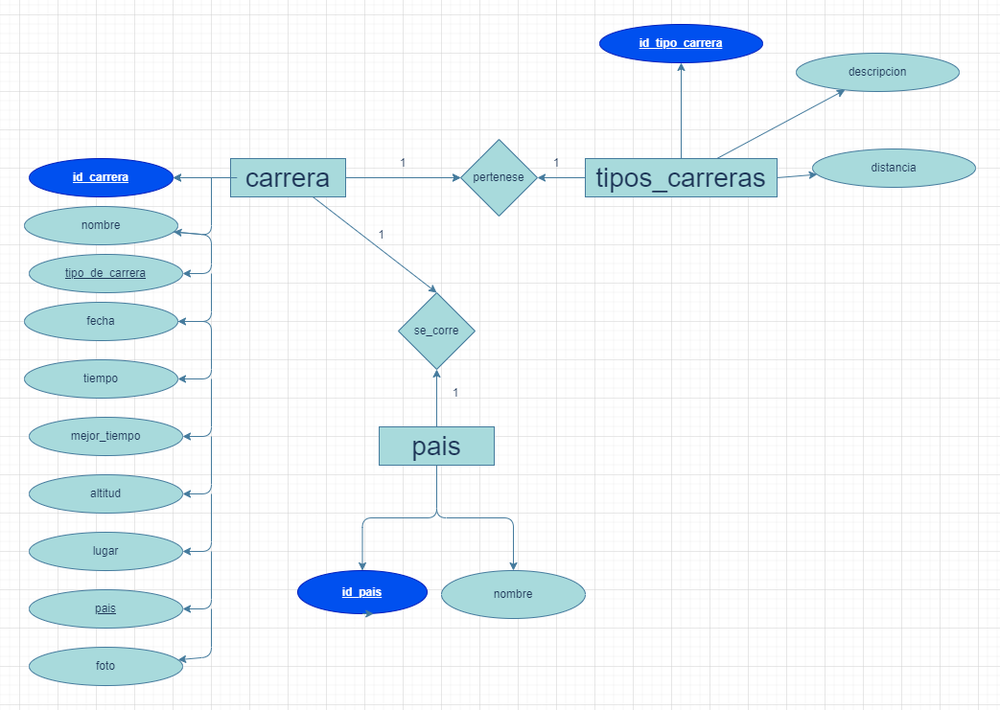
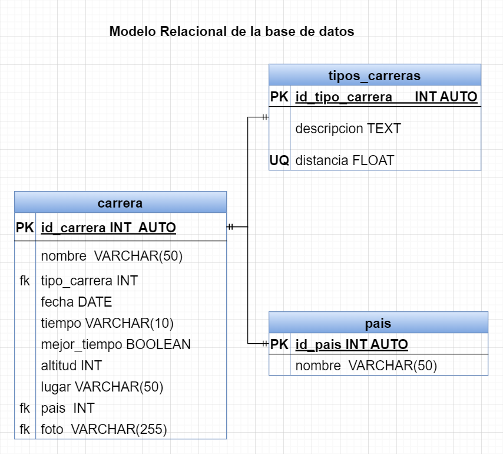

# carrera

## listado de entidades

### carreras **ENTIDAD DATOS**

- id_carrera **PK**
- nombre
- tipo_de_carrera **fK**
- fecha
- tiempo
- mejor_tiempo
- altitud
- lugar
- pais **fK**
- foto

### tipo_de_carrera **ENT CATALOGO**

- id_tipo_de_carrera **PK**
- descripcion
- distancia **UQ**

### Pais **ENT CATALOGO**

- id_pais **PK**
- nombre

## relaciones

- Una **Carrera** _pertenece_ a un **Tipo_de_carrera**.(1 a 1).
- Una **carrera** se _corre_ en un **pais**.

## Diagramas

### Modelo entidad - relación

### Modelo Relacional de la BD

## Reglas de negocio (CRUD)

### carreras
1. Crear el registro de una carrera.
1. Leer el registro de una(s) cerrera(s) dada una condición en particular.
1. Leer todos los registros de la entidad.
1. Actualizar los datos de una carrera dada una condición en particular.
1. Eliminar los datos de una carrera dada una condición en particular.

### tipo_de_carrera
1. Crear el registro de un tipo de carrera
1. Leer el registro de un(os) tipo(s) de carrera(s)dada una condición particular.
1. Leer todos los registros de la entidad tipos de carreras.
1. Actualizar los datos de un tipo de carrera dada una condición particular.
1. Eliminar los datos de un tipo de carrera dada una condición particular.

### Pais

1. Crear el registro de un pais.
1. Leer el registro de un(os) pais(es) dada una condicón particular.
1. Leer todos los registros de la entidad pais.
1. Actualizar los datos de un pais dada una condición particular.
1. Eliminar los datos de un pais dada una condición particular.   

